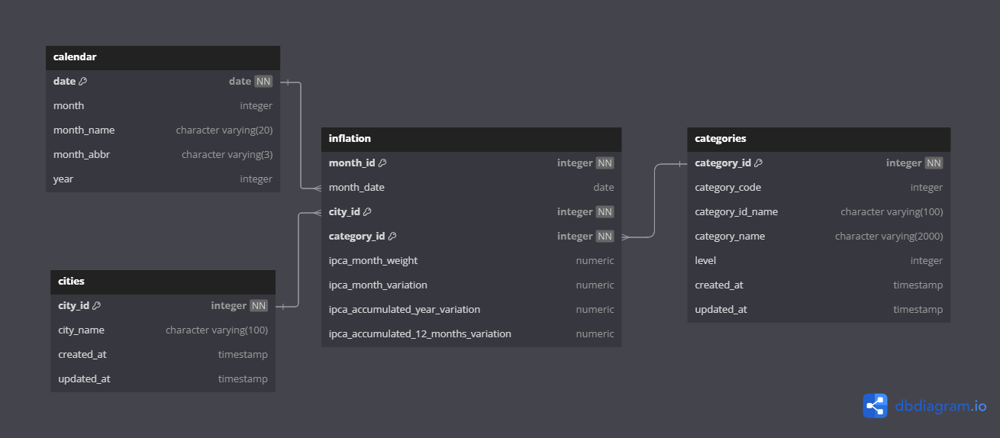
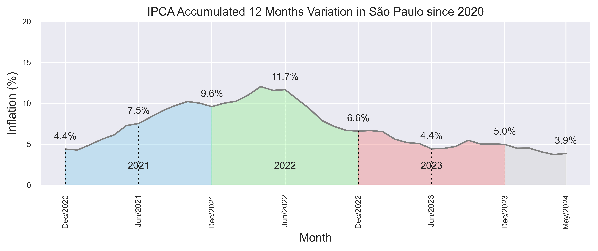

# Brazil Inflation Data Model

This project aims to **create a data model** to store the **inflation data** from the Brazilian Institute of Geography and Statistics (IBGE) API.

Table of Contents:
- [Brazil Inflation Data Model](#brazil-inflation-data-model)
  - [Brazil Inflation](#brazil-inflation)
  - [Data Source](#data-source)
  - [Data Model](#data-model)
  - [Usages](#usages)
  - [Data Engineering](#data-engineering)
  - [Technologies Used](#technologies-used)
  - [How to run](#how-to-run)
    - [Prerequisites](#prerequisites)
    - [Running the project](#running-the-project)

## Brazil Inflation

Brazil historically has a traumatic inflation history. The country has faced hyperinflation in the past, with inflation rates [reaching 81.3% in March 1990](https://en.wikipedia.org/wiki/Hyperinflation_in_Brazil).

Nowadays, the inflation rate is under control, but it is still a relevant economic indicator.

The inflation rate is calculated by the National Consumer Price Index (IPCA), which is released monthly by the Brazilian Institute of Geography and Statistics (IBGE).

The IPCA is calculated based on the prices of a basket of goods and services consumed by Brazilian families.

## Data Source

The data source is the IPCA API from the Brazilian Institute of Geography and Statistics (IBGE).

For API details, check the [API](API.md) documentation.

## Data Model

The data model is composed of 4 tables.



- `inflation` is the **fact** table with inflation data
- `cities` is a dimension table with the cities where the inflation data was collected
- `categories` is a dimension table with the categories of products and services
- `calendar` is a dimension table with the dates of the inflation data

More on the data model in the [Data Model](Data%20Model.md) documentation.

## Usages

The data is ready to be used in any data analysis tool, such as Power BI or Python.

For example, from this query: 

```sql
select 
    cal.month_abbr || '/' || cal.year as month, 
    i.ipca_accumulated_12_months_variation as value
from
    inflation i
join categories cat
        using (category_id)
join cities cit
        using (city_id)
join calendar cal on
    cal."date" = i.month_date
where
    cat."level" = 0
    and cit.city_name = 'São Paulo'
    and i.ipca_accumulated_12_months_variation is not null
```

The following graph can be generated, to show the inflation rate 12 months accumulated value for São Paulo city:




## Data Engineering

This project is a good example of API data ingestion framework.

Read more in the [Data Engineering](Data%20Engineering.md) documentation for details on the data pipeline.

## Technologies Used

-  for **infrastructure and containerization**  
-  for **data storage**
-  for **data processing**
-  for **data pipeline orchestration**

For more notes on the project architecture, check the [Architecture](Architecture.md) documentation.

## How to run

### Prerequisites

- [Docker](https://www.docker.com/get-started)

This project uses **Docker** to run the **PostgreSQL** database and **Airflow** services.    

Install Docker Desktop for your OS and **make sure it is running.**


- Optional: [Python](https://www.python.org/downloads/)

Everything runs inside Docker containers, so you don't need to install anything else, unless you want to run analysis on data with Python or other tools.

- Optional: [DBeaver](https://dbeaver.io/download/)

DBeaver is a free database client that can be used to access the PostgreSQL database. It is not required, but it is a good tool to have to check the data in the database of the project.

### Running the project

1. Clone the repository:

```bash
git clone 
```

2. Run `docker compose` in the root directory of the project:

```bash
cd path/where/you/cloned/the/repo

docker compose up -d
```
    Note: the ETL process will begin automatically.

3. Access the Airflow UI in your browser at port `8980`:

```bash
http://localhost:8980
```

    Note: user: admin, password: admin

4. Access the PostgreSQL database with your favorite database client at port `5432`:

```bash
Host: localhost
Port: 5432
Database: postgres
User: postgres
Password: postgres123
```